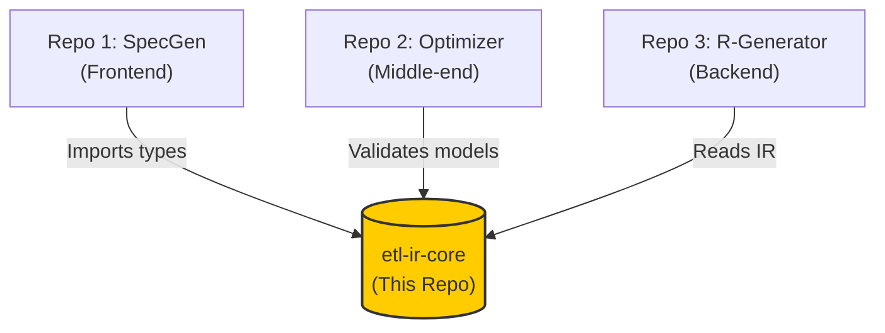

# etl-ir-core
# ETL Compiler: Shared IR Core (`etl-ir-core`)


# 🧠 ETL IR Core (Intermediate Representation)

This library defines the **Strict Type System** for the compiler platform. It serves as the contract between the Parser (SPSS) and the Generator (R).

## Why It Matters
By decoupling the input language from the output language, we avoid an $N \times M$ complexity problem. We parse once to IR, and can generate code for **R**, **Python**, **SQL**, or **Excel** from the same model.

## Data Structures
* **`Pipeline`**: The top-level container carrying Metadata, Datasets, and Operations.
* **`Operation`**: Atomic logic units (e.g., `COMPUTE_COLUMNS`, `FILTER_ROWS`).
* **`DataType`**: Strict enum types ensuring we never mix Strings and Integers accidentally.

## Usage
```python
from etl_ir.model import Pipeline, Operation
# Strictly typed validation via Pydantic

```

```

---

> **The Single Source of Truth for the ETL Compiler Toolchain.**

This repository contains the **Schema Definitions**, **Pydantic Models**, and **Enumerations** that define the Intermediate Representation (IR) used across the entire compiler lifecycle. 

It exists to prevent "Schema Drift" and code duplication by ensuring that the Parser, Optimizer, and Generator all speak exactly the same language.

## 🏗 Architecture Role

In the 3-stage compiler architecture, this library acts as the shared dependency:



## 📦 Contents

The package `etl_ir` exposes two main modules:

1. **`types.py`**: Strict Enumerations for type safety.
* `OpType`: Defines valid operations (e.g., `LOAD_CSV`, `COMPUTE_COLUMNS`, `FILTER_ROWS`).
* `DataType`: Defines supported data types (e.g., `INTEGER`, `STRING`, `UNKNOWN`).


2. **`model.py`**: Pydantic models for data validation.
* `Pipeline`: The root object containing datasets and operations.
* `Operation`: A single processing step.
* `Dataset`: Schema definition for a data node.


## 🛠️ Installation & Linking

Since this is a shared local library, it is designed to be installed in **Editable Mode** within the sibling repositories.

### Directory Structure Assumption

Ensure your workspace is set up with sibling directories:

```text
/workspace/
├── etl-ir-core/          <-- This Repo
├── spec_generator/       <-- Dependent Repo
├── etl_optimizer/        <-- Dependent Repo
└── etl-r-generator/      <-- Dependent Repo

```

### How to Link (For Developers)

To use this core library in another repo (e.g., `etl-r-generator`), run the following command inside that repo's virtual environment:

```bash
# Install this repo in "Editable Mode"
pip install -e ../etl-ir-core

```

This creates a symlink-like reference. Any changes you make to `etl-ir-core` will immediately be reflected in the other tools without needing to reinstall.

## 💻 Usage Example

Once installed, you can import the shared types directly:

```python
from etl_ir.model import Pipeline, Operation
from etl_ir.types import OpType

# Create a validated operation
op = Operation(
    id="op_101",
    type=OpType.LOAD_CSV,
    inputs=[],
    outputs=["source_data"],
    parameters={"filename": "data.csv"}
)

print(op.model_dump_json(indent=2))

```

## 🧪 Testing

Run the unit tests to verify schema integrity:

```bash
# Install dev dependencies
pip install pytest pytest-cov

# Run tests
PYTHONPATH=src:. pytest --cov=src --cov-report=term-missing

```
